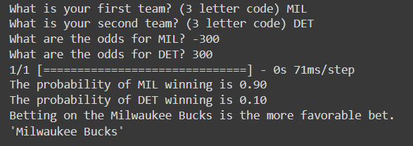
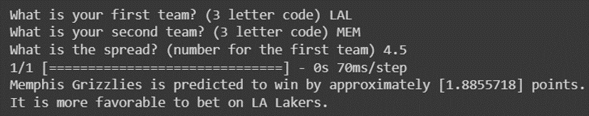

# L.E.B.R.O.N.

L.E.B.R.O.N. is a chatbot that uses a machine learning model to predict the outcome of NBA games and give the user advice on how to make favorable sports bets, narrated by none other than LeBron James himself.

## Demo

https://user-images.githubusercontent.com/62364808/233006723-20bd1ad8-c262-4e3a-bffe-6241ebfc9661.mp4

## Technology

The chatbot front-end was built using the [React](https://react.dev/) javascript framework and the [`react-chatbot-kit`](https://www.npmjs.com/package/react-chatbot-kit) package, connected to a [LangChain](https://github.com/hwchase17/langchain) conversational agent which called [OpenAI's GPT-3 API](https://openai.com/product). The LeBron voice narration was made using calls to the [ElevenLabs](https://beta.elevenlabs.io/) text-to-voice API using a custom-made voice model. The chatbot runs locally.

The sports betting model was built and trained using [TensorFlow](https://www.tensorflow.org/), and we attempted to create an interface for it using [FastAPI](https://fastapi.tiangolo.com/) but ultimately didn't have enough time. Because the chatbot is powered by LangChain, it would be relatively straightforward to add the model as a tool for the conversational agent.

## More info

This project was completed in 24 hours for the HackAI 2023 hackathon with [Suvel Muttreja](https://github.com/suvelmuttreja) and [Wei-Chen Huang](https://github.com/weichenhuang1) ([Devpost link](https://devpost.com/software/l-e-b-r-o-n)). I created the chatbot interface and the LangChain agent and integrated the voice narration, Suvel created the voice model and worked on the interface, and Wei-Chen trained and tested the betting model.

