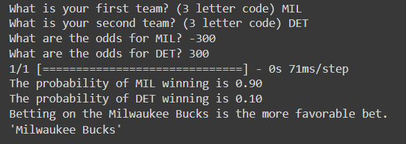
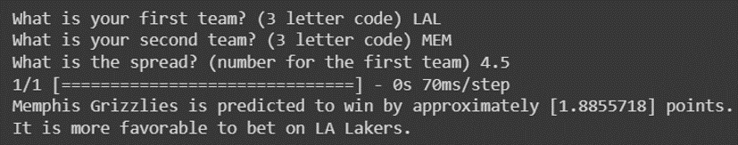

L.E.B.R.O.N. is a chatbot that uses a machine learning model to predict the outcome of NBA games and give the user advice on how to make favorable sports bets, narrated by none other than LeBron James himself.

https://user-images.githubusercontent.com/62364808/233006723-20bd1ad8-c262-4e3a-bffe-6241ebfc9661.mp4

Currently, the betting model is not connected to the chatbot interface, but because the chatbot is powered by LangChain, it would be relatively simple to add the model as a tool for the conversational agent. It also only runs locally. This project was completed in 24 hours for the HackAI 2023 hackathon with [Suvel Muttreja](https://github.com/suvelmuttreja) and [Wei-Chen Huang](https://github.com/weichenhuang1) ([Devpost link](https://devpost.com/software/l-e-b-r-o-n)). I created the chatbot interface and the LangChain agent and integrated the voice narration, Suvel created the voice model and worked on the interface, and Wei-Chen trained and tested the betting model.

# Looking forward

- Connect the chatbot interface to the betting model
    - Create API interface for the model
    - Add it as a tool for the LangChain converserational agent
- Add ability to ask questions about historical NBA games database
    - Would involve adding the SQL toolkit to the langchain agent
- Improve betting model accuracy
    - Currently at 60–65%
- Host the chatbot on a server
- Add animated avatar feature
